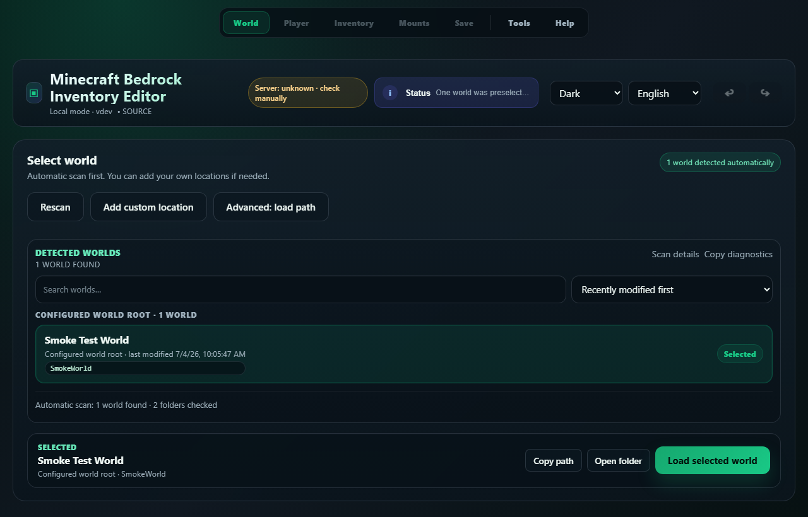
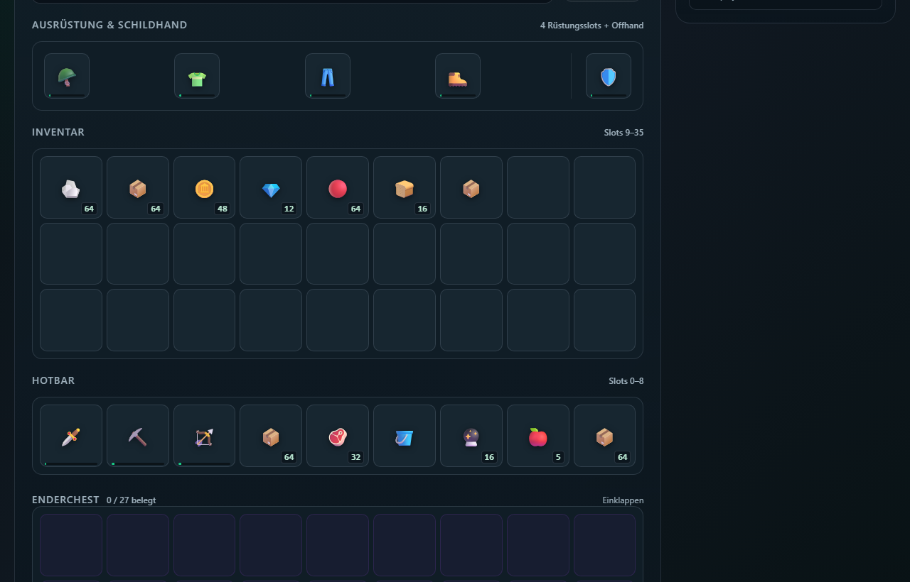

# Minecraft Bedrock Inventory Editor

**🇬🇧 English** | [🇩🇪 Deutsch](README.de.md)

[](https://github.com/dadeeen/MCBE_Inventory_Editor/actions/workflows/ci.yml)
[](LICENSE)
[](#local-windows-setup)

A local web editor for selected Minecraft Bedrock player data: inventory, ender chest, effects, abilities, player values, and experimental mounts.

The interface is available in English and German. A switcher in the header changes it at any time; browsers requesting German get the German interface automatically.

This is an unofficial community project. It is not affiliated with, endorsed by, or associated with Mojang Studios or Microsoft.

> **Before every edit:** stop Minecraft or the Bedrock server and create a complete, independent copy of the world. Keep that copy until the edited world has been verified in Minecraft. App-created backups are an additional safeguard, not a replacement.

The editor is intended for local use and trusted home networks. Do not expose it directly to the public internet.

[](docs/assets/editor-overview.png)

[](docs/assets/editor-inventory.png)

## Download → backup → start

1. Open [GitHub Releases](https://github.com/dadeeen/MCBE_Inventory_Editor/releases).
2. Download the asset ending in `_runtime.zip` and its `.sha256` file. The automatically generated **Source code** archives are repository snapshots, not ready-to-run packages.
3. Verify the checksum if desired:
   - Windows: `Get-FileHash <runtime.zip> -Algorithm SHA256`
   - Linux: `sha256sum <runtime.zip>`
4. Stop Minecraft or the server and copy the complete world folder to an independent location.
5. Install [Python 3.12 for Windows](https://www.python.org/downloads/windows/) if it is not already available. Python 3.11, 3.13, and 3.14 are not supported. During installation, enable the Python Launcher or **Add Python to PATH**.
6. Extract the runtime ZIP, run `setup.bat` once, then start the editor with `start.bat`.
7. On first start, follow the setup dialog and load **Item DB** and **Vanilla icons**. You can postpone this and return through the setup notice or **Tools** later. The editor ships with a bundled item snapshot and no icons, so without this step items from newer Minecraft versions are missing and every slot shows a placeholder symbol.

If no release is available yet, experienced users can use the source setup below.

## Why this exists

The editor was written for a private Bedrock server. Small corrections to a player's inventory or values meant copying world files to a Windows machine every time — far more effort than a routine fix deserves.

The goal was to make those adjustments possible from any device on the same network. The Docker deployment runs alongside the server and the browser interface works from a laptop, tablet, or phone, with no Windows machine and no local copy of the world involved.

That origin explains the scope: a reviewed set of player fields, edited with the world stopped and a backup in place, rather than a general-purpose world editor.

## What it supports

| Area | Scope |
|---|---|
| Inventory | Hotbar, backpack, armor, offhand, moving, copying, and bulk actions |
| Ender chest | Viewing and editing, including transfers between visible areas |
| Player values | Health, game mode, XP, hunger, saturation, position, effects, and abilities |
| Safety | Pre-write backups, restore checks, revision checks, write gates, and world locks |
| Player transfer | Versioned local ↔ multiplayer migration and complete `.mcbe-player.zip` import/export |
| Icons | Vanilla icon download, local resource packs, `.mcpack`, `.zip`, and custom icon folders |
| Mounts | Experimental creation of horses, donkeys, mules, skeleton horses, and camels |
| Diagnostics | World status, runtime checks, reports, and private raw-player export |

The app is not a public hosting service, server administration panel, or unrestricted raw NBT editor.

## Local Windows setup

Local Mode requires **Python 3.12** because the native Amulet dependencies are version-specific.

From the source tree or an extracted runtime package:

```bat
setup.bat
start.bat
```

`setup.bat` creates `.venv` inside the project folder and installs no global Python packages. The editor listens on `127.0.0.1:5000`; app data is stored under `data/`.

Administrator rights should not normally be needed. If a safely stopped world cannot be saved because of Windows permissions, running `start.bat` as administrator can be used as a diagnostic test. It does not make editing a running world safe.

## Docker and trusted LANs

For a published release, pull the matching version-specific tag. Replace `X.Y.Z` with the version shown on the [Releases page](https://github.com/dadeeen/MCBE_Inventory_Editor/releases); the Docker tag omits the leading `v` from the Git tag:

```bash
docker pull ghcr.io/dadeeen/mcbe-inventory-editor:X.Y.Z
```

Stable version tags also update the matching minor tag (for example `0.5`) and `latest`. Pre-release tags publish only their full version and revision tags; they never move `latest`. Prefer the exact version tag for deployments because `latest` and minor tags are intentionally mutable.

To build the current checkout locally instead:

```bash
docker build -t mcbe-inventory-editor:local .
```

Minimal Compose example using the published image:

```yaml
services:
  mcbe-editor:
    image: ghcr.io/dadeeen/mcbe-inventory-editor:X.Y.Z
    restart: unless-stopped
    ports:
      - "8088:8080"
    environment:
      MCBE_SERVER_HOST: "192.168.1.100"
      MCBE_SERVER_PORT: "19132"
    volumes:
      - /PATH/TO/BEDROCK/WORLDS:/worlds:rw
      - mcbe-editor-data:/data:rw

volumes:
  mcbe-editor-data:
```

The checked-in [`docker-compose.example.yml`](docker-compose.example.yml) is the corresponding source-build example and builds the current checkout instead of pulling GHCR.

On first open, set a password or explicitly confirm passwordless use on a trusted network. Protect the port with host firewall rules and never add public ingress or a public tunnel.

Important Docker behavior:

- Worlds are read from `/worlds`; persistent app data and backups are stored under `/data`.
- `MCBE_REQUIRE_SERVER_OFFLINE=true` is the default. A reachable configured Bedrock server blocks writes; unknown status requires confirmation.
- `MCBE_READ_ONLY=true` switches the app into read-only viewer mode. For a real viewer deployment, also mount `/worlds:ro`; Docker's `read_only: true` alone does not protect mounted worlds.
- For write-enabled deployments, mount the common parent directory of the worlds at `/worlds`, not one individual world. Restore staging and rollback need access to sibling paths.
- The container runs as non-root UID/GID `10001`; the host directory must grant the required access. A `:rw` mount alone is not enough — set this up **before** the first save, see [Write permissions for Docker worlds](#write-permissions-for-docker-worlds).
- The first-start setup notice applies here too: **Item DB** and **Vanilla icons** are stored under `/data`, so keep that volume persistent and allow outbound HTTPS from the container.
- A successful full Item DB update stores a verification receipt beside the database under `/data`. It is bound to the exact database file and its source metadata: changing browsers keeps the verified state, while deleting or replacing `/data` intentionally requires one new full Item DB update.

### Write permissions for Docker worlds

A `:rw` mount alone does not give the process inside the container write permission. The editor deliberately runs as non-root UID/GID `10001`. An error such as

```text
IO error: /worlds/MyWorld/db/LOCK: Permission denied
```

means that UID `10001` cannot write the LevelDB directory or create the `LOCK` file there. This can be true even when `LOCK` does not exist yet.

Stop the Bedrock server before making any of the following changes and first resolve the actual mounted host path:

```bash
docker inspect mcbe-editor --format \
  '{{range .Mounts}}{{println .Source "->" .Destination "Mode:" .Mode}}{{end}}'
```

Replace `mcbe-editor` with your container name when necessary.

#### Recommended: targeted ACL for UID 10001

This keeps the server files' existing owner and group while granting only the editor additional access. On Debian/Ubuntu, install the `acl` package first when needed (use the corresponding package manager on other distributions), then set `WORLDS_ROOT` to the host path mounted at `/worlds`:

```bash
sudo apt-get install -y acl

WORLDS_ROOT=/var/lib/docker/volumes/MY_VOLUME/_data/worlds

sudo setfacl -R -m u:10001:rwX "$WORLDS_ROOT"
sudo find "$WORLDS_ROOT" -type d -exec setfacl -m d:u:10001:rwX {} +
```

The default ACL on each directory lets newly created files and subdirectories inherit editor access. Continue to mount the common worlds directory rather than one individual world so restore and rollback can create their safe temporary sibling paths.

Verify the actual world directory afterwards. `ls /worlds` prints the real folder names, so set `WORLD` to one of them rather than leaving the placeholder in place:

```bash
docker exec mcbe-editor sh -lc '
id
ls /worlds
WORLD=/worlds/MyWorld/db
if [ ! -d "$WORLD" ]; then
  echo "Path not found: $WORLD"
elif [ -w "$WORLD" ]; then
  echo "World database is writable"
else
  echo "World database is NOT writable"
fi
'
```

#### Compatibility mode: shared group or shared UID

If ACLs are not reliably available on the host filesystem, the Bedrock server and editor can deliberately use a dedicated shared group. Example with GID `12000`:

```yaml
services:
  mcbe-editor:
    group_add:
      - "12000"
```

On the host, the world files must belong to that group, be group-writable, and make new subdirectories inherit the group:

```bash
WORLDS_ROOT=/var/lib/docker/volumes/MY_VOLUME/_data/worlds

sudo chgrp -R 12000 "$WORLDS_ROOT"
sudo chmod -R g+rwX "$WORLDS_ROOT"
sudo find "$WORLDS_ROOT" -type d -exec chmod g+s {} +
```

The Bedrock server process needs the same supplemental group. Both processes must create new files as group-writable, typically with `umask 0002`; without that shared umask, group mode is not reliable for files created later.

For maximum compatibility, both containers can instead deliberately run under the same **unprivileged** UID/GID:

```yaml
services:
  mcbe-editor:
    user: "1234:1234"  # Example: the same UID/GID as the Bedrock server
    volumes:
      - /srv/bedrock/worlds:/worlds:rw
      - /srv/mcbe-editor-data:/data:rw
```

Before startup, `/srv/bedrock/worlds` and `/srv/mcbe-editor-data` must be writable by that identity. Never use UID `0` here. This shared identity is more reliable with restrictive umasks, but reduces isolation further: from the kernel's perspective, the editor and server have identical file permissions.

Both compatibility variants reduce isolation. Every process and user in the shared group or using the shared UID can modify the worlds. Use a dedicated group or unprivileged service UID, never a broadly shared system group.

Unsupported shortcuts:

- do not run `chmod -R 777` on world or data directories;
- do not add `privileged: true` or run the editor as root to bypass filesystem permissions;
- do not delete LevelDB's `db/LOCK` file or disable locking to bypass a running server.

Those measures do not fix the ownership and permission cause, or they remove important isolation and concurrent-access safeguards.

The included `docker-compose.viewer.example.yml` shows a hardened viewer configuration. Local helper scripts live under `scripts/docker/`.

## Safe workflow

1. Stop Minecraft or the Bedrock server.
2. Create an independent copy of the complete world.
3. Select the world and player in the editor.
4. Make and review the changes.
5. Save. An actual write creates a backup first.
6. Close the editor, open the world in Minecraft, and verify the result.
7. Keep the independent copy until verification is complete.

The editor does not stop or start Minecraft or a Bedrock server itself.

## Player migration and import

**Local ↔ multiplayer migration** transfers an explicit allowlist of gameplay state while preserving the destination player identity and unknown destination fields. This includes reviewed vanilla attributes, the last death location, sleep/phantom state, and recipe unlocks. Recipes are merged without loss: missing source recipes are added while existing target recipes are preserved. The destination multiplayer player must already have joined the world once. The source record is not deleted, and pet ownership is not reassigned.

A complete `.mcbe-player.zip` import is different: it writes the exported player record as a whole. Both operations create a verified backup, validate the write, and attempt rollback on failure. Always verify the resulting player in Minecraft.

Player exports contain raw, non-anonymized NBT data. Treat them as private and do not attach them to public issues or commit them to a repository.

For private CLI diagnostics. The commands call the interpreter from `.venv`, because the Amulet dependencies are not installed globally:

```bash
.venv/Scripts/python scripts/export_player_raws.py list --world "/PATH/TO/WORLD"
.venv/Scripts/python scripts/export_player_raws.py export --world "/PATH/TO/WORLD" --all --bundle-zip
```

On Linux and macOS the interpreter is `.venv/bin/python`.

## Experimental mounts

The Mounts view can stage horses, donkeys, mules, skeleton horses, and camels near the player in the Overworld. Placement is checked against decoded terrain:

- green candidates are accepted;
- yellow candidates could not be proved safe and require explicit confirmation;
- red candidates are rejected server-side.

Staging does not write to the world. The confirmed workspace save creates one backup and writes player and mount records together. Terrain, dimensions, add-ons, and future Bedrock versions are not fully covered, so test this feature on expendable world copies first.

## Data safety and privacy

The editor deliberately leaves unsupported Bedrock and add-on data untouched instead of behaving like a full raw NBT editor. Unknown formats can still invalidate assumptions, and no backup or validation can guarantee semantic correctness for every world or future Minecraft version.

Security essentials:

- Local Mode binds only to `127.0.0.1` by default.
- Editing worlds works fully offline. Outbound HTTPS is used only for **Item DB** and **Vanilla icons** updates you trigger yourself, using a fixed host allowlist for GitHub and `learn.microsoft.com`. Optionally, `MCBE_STARTUP_NETWORK_CHECK=true` checks whether those hosts are reachable at startup. The application does not contact `minecraft.wiki` at runtime.
- Docker/LAN setup requires a password decision on first use.
- Mutating requests use CSRF/Origin checks and loaded-player revisions.
- World writes are serialized and re-check the server status immediately before writing.
- No-op saves write nothing and create no backup.
- Restore creates a pre-restore backup and verifies the archive before replacement.
- Audit logs, diagnostic reports, backups, worlds, and player exports may contain private or identifying information. Do not publish them without careful sanitization.

See [SECURITY.md](SECURITY.md) for vulnerability reporting and the supported security boundary.

Runtime data does not belong in the repository or release archives. Typical locations are:

```text
data/                  # Local Mode
/data/                 # Docker Mode
/data/backups/         # Docker backups
/data/audit/events.jsonl
```

## Compatibility and limitations

- The application is for local or trusted-LAN use, not public deployment.
- Real world edits must happen while Minecraft or the server is stopped.
- Bedrock updates, add-ons, opaque NBT, and unusual LevelDB structures can fall outside what the editor is designed to handle.
- Experimental mount placement is not full Minecraft collision physics.
- Runtime ZIPs have a SHA-256 checksum and an internal file manifest, but no independent cryptographic signature.

## Development and license

Bug reports and contributions are welcome. Use synthetic data and sanitized logs; never attach real worlds, backups, player exports, audit exports, player names, private paths, or credentials.

Contributor instructions, tests, fixtures, and release hygiene are in [docs/development.md on GitHub](https://github.com/dadeeen/MCBE_Inventory_Editor/blob/main/docs/development.md). Internal save invariants are documented in [docs/save_contract.md](https://github.com/dadeeen/MCBE_Inventory_Editor/blob/main/docs/save_contract.md).

The project's own code is licensed under the [MIT license](LICENSE). The application depends on `amulet_nbt` and `amulet_leveldb`, which use the Amulet Team License 1.0.0 (PolyForm Shield and Noncommercial terms, with a limited exception for commercial use exclusively for educational purposes). This is not a conventional open-source license and restricts permitted use; the upstream license texts are authoritative. `amulet_mutf8` is MIT-licensed.

Minecraft content is not covered by this project's license. The repository includes an item-data snapshot generated from `Mojang/bedrock-samples` and Microsoft Learn; vanilla icons are downloaded only on request and are not shipped. The origin of the locally maintained enchantment maximum levels is documented in [docs/development.md on GitHub](https://github.com/dadeeen/MCBE_Inventory_Editor/blob/main/docs/development.md#bundled-item-database-and-enchantment-max-levels). Minecraft and its content belong to Mojang Studios/Microsoft and remain subject to their terms.

Key upstream projects include [Amulet Team](https://github.com/Amulet-Team), [NumPy](https://numpy.org/), Flask and the Pallets team, and the [Minecraft Wiki](https://minecraft.wiki/) as a reference for manually verified gameplay mechanics.
